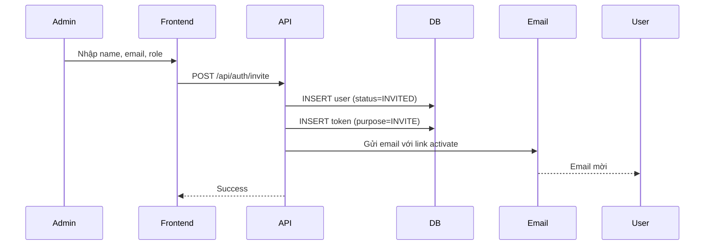
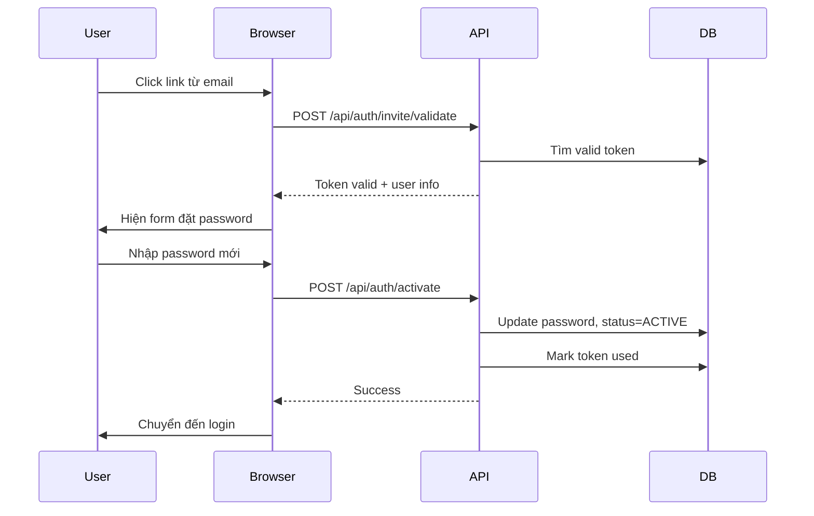

# Account Activation / Email Verification Feature

Hệ thống kích hoạt tài khoản qua email cho OCR Editor.

## Tổng quan

Khi admin tạo user mới, hệ thống sẽ:
1. Tạo user với `status = INVITED`
2. Gửi email mời chứa link kích hoạt
3. User click link → đặt password → tài khoản được kích hoạt (`status = ACTIVE`)

---

## Cấu trúc Files

### Database
| File | Mô tả |
|------|-------|
| `migrations/001_add_account_activation.sql` | Migration thêm cột `status`, `email_verified_at` vào bảng `users` và tạo bảng `user_tokens` |

### Models
| File | Mô tả |
|------|-------|
| `lib/models/user.ts` | Thêm properties `status`, `email_verified_at` |
| `lib/models/user_token.ts` | Model cho bảng `user_tokens` |

### Repositories
| File | Mô tả |
|------|-------|
| `lib/modules/user/repositories/user_token_repo.ts` | CRUD cho tokens (invite, password reset) |

### Utilities
| File | Mô tả |
|------|-------|
| `lib/utils/token.ts` | `generateToken()`, `hashToken()`, `createTokenPair()`, `getExpiresAt()` |
| `lib/utils/email.ts` | `sendEmail()` với nodemailer |

### Service Logic
| File | Mô tả |
|------|-------|
| `lib/modules/user/applications/user_app.ts` | `inviteUser()`, `activateUser()`, `resendInvite()` |

### API Endpoints
| Endpoint | Method | Mô tả |
|----------|--------|-------|
| `/api/auth/invite` | POST | Admin tạo invite user mới |
| `/api/auth/invite/validate` | POST | Validate token |
| `/api/auth/invite/resend` | POST | Admin gửi lại email mời |
| `/api/auth/activate` | POST | User kích hoạt tài khoản |

### Frontend
| File | Mô tả |
|------|-------|
| `app/[locale]/(pages)/activate/page.tsx` | Route `/activate?token=...` |
| `components/activate/ActivateContainer.tsx` | UI kích hoạt tài khoản |
| `components/admin/users/UsersContainer.tsx` | Admin UI với status badge, resend button |

---

## Flow Chi Tiết

### 1. Admin Invite User



### 2. User Activate Account



---

## Database Schema

### Bảng `users` (columns mới)

| Column | Type | Default | Mô tả |
|--------|------|---------|-------|
| `status` | VARCHAR(50) | 'ACTIVE' | INVITED / ACTIVE |
| `email_verified_at` | TIMESTAMPTZ | NULL | Thời điểm verify email |

### Bảng `user_tokens`

| Column | Type | Mô tả |
|--------|------|-------|
| `id` | SERIAL | Primary key |
| `user_id` | INT | FK đến users.id |
| `token_hash` | VARCHAR(255) | Hash SHA256 của token |
| `purpose` | VARCHAR(50) | INVITE / RESET_PASSWORD |
| `expires_at` | TIMESTAMPTZ | Thời điểm hết hạn |
| `used_at` | TIMESTAMPTZ | Thời điểm sử dụng (NULL = chưa dùng) |
| `created_at` | TIMESTAMPTZ | Thời điểm tạo |
| `metadata` | JSONB | Dữ liệu bổ sung |

---

## API Details

### POST /api/auth/invite

**Request:**
```json
{
  "name": "John Doe",
  "email": "john@example.com",
  "role": "user"
}
```

**Response:**
```json
{
  "success": true,
  "data": {
    "user": { "id": 5, "name": "John Doe", "email": "john@example.com" },
    "token": "abc123..." // (chỉ trả về trong dev mode)
  }
}
```

### POST /api/auth/invite/validate

**Request:**
```json
{
  "token": "abc123..."
}
```

**Response (valid):**
```json
{
  "success": true,
  "data": {
    "valid": true,
    "user": { "name": "John Doe", "email": "john@example.com" }
  }
}
```

### POST /api/auth/activate

**Request:**
```json
{
  "token": "abc123...",
  "password": "newPassword123"
}
```

**Response:**
```json
{
  "success": true,
  "message": "Account activated successfully"
}
```

### POST /api/auth/invite/resend

**Request:**
```json
{
  "userId": 5
}
```

---

## Cấu hình SMTP

Thêm vào file `.env`:

```env
SMTP_HOST=smtp.gmail.com
SMTP_PORT=587
SMTP_USER=your-email@gmail.com
SMTP_PASS=your-app-password
```

**Lưu ý với Gmail:** Cần tạo App Password (không dùng password thường).

---

## Admin UI Features

### Status Column
- **Active** (badge xanh): User đã kích hoạt
- **Invited** (badge vàng): User chưa kích hoạt

### Actions
| Icon | Mô tả |
|------|-------|
| ✏️ Edit | Sửa tên, role |
| 📧 Mail | Gửi lại email mời (chỉ hiện với INVITED) |
| 🗑️ Delete | Xóa mềm user |

---

## Security

1. **Token hashing**: Token được hash SHA256 trước khi lưu DB
2. **Token expiry**: Default 48 giờ
3. **Single use**: Token được đánh dấu `used_at` sau khi sử dụng
4. **Password policy**: Tối thiểu 6 ký tự
5. **Role-based**: Chỉ Admin/SuperAdmin được invite user

---

## i18n Keys

Các translation keys mới trong `i18n/locales/users/*.json`:

- `status`, `invited`
- `inviteSuccess`, `inviteFailed`
- `resendSuccess`, `resendFailed`
- `inviteInfo`, `editUser`, `save`, `edit`, `cancel`
